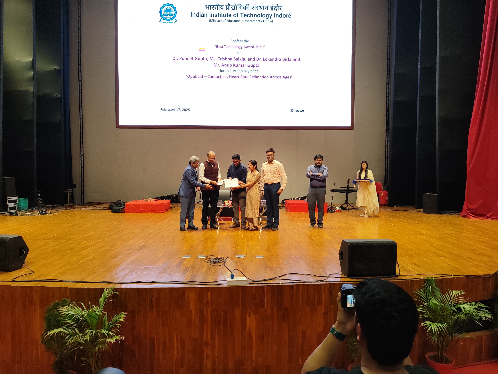
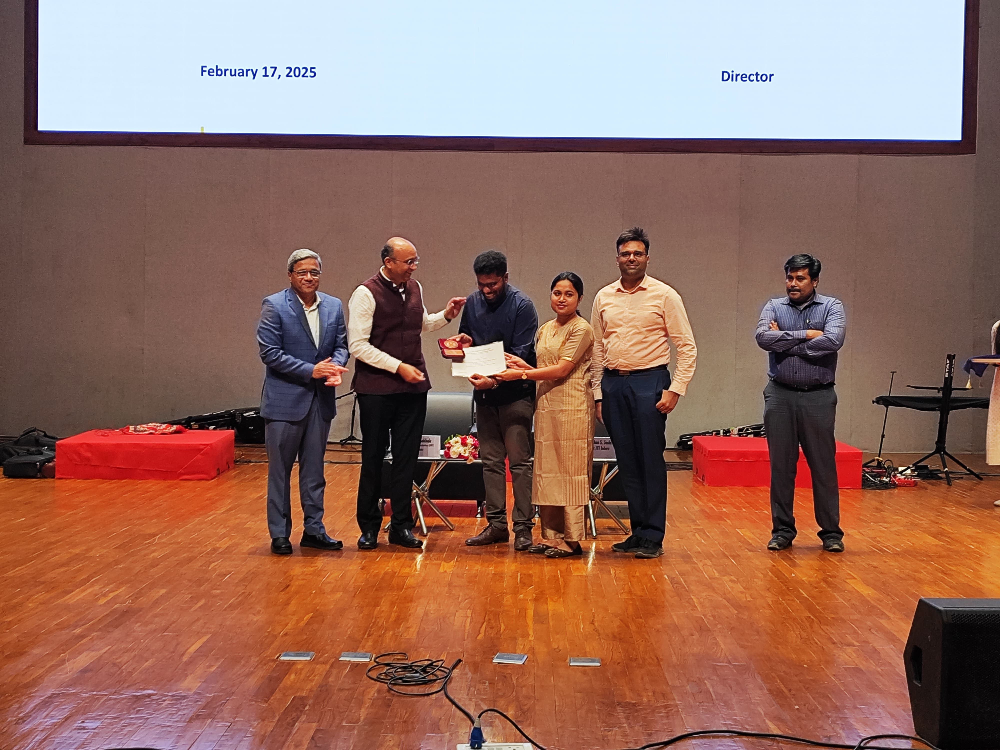
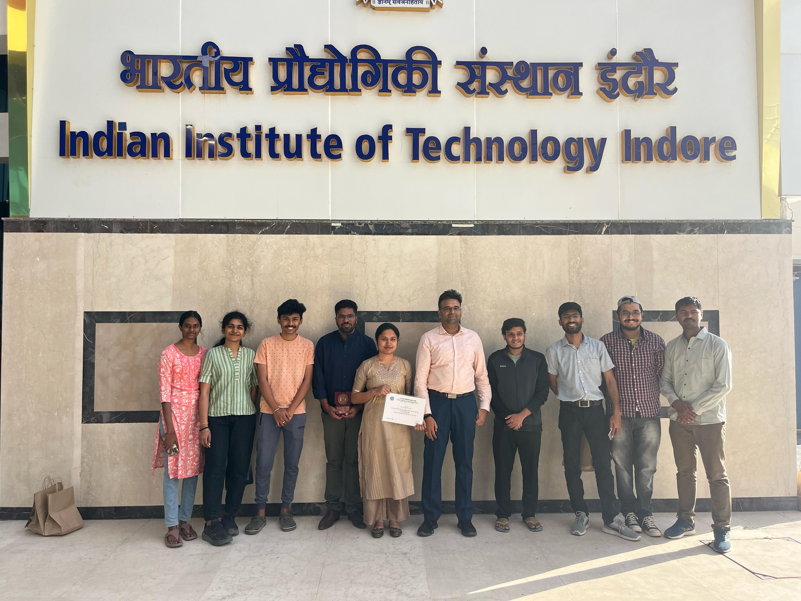
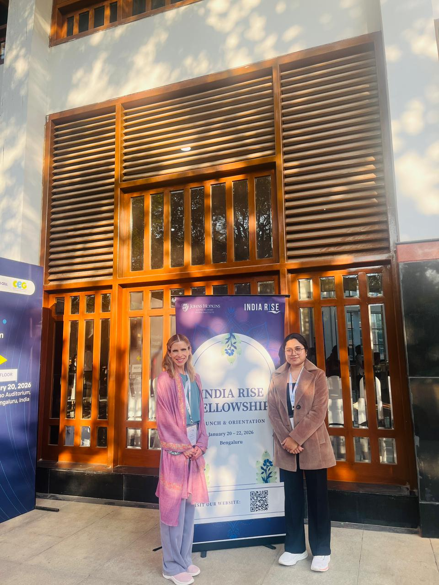
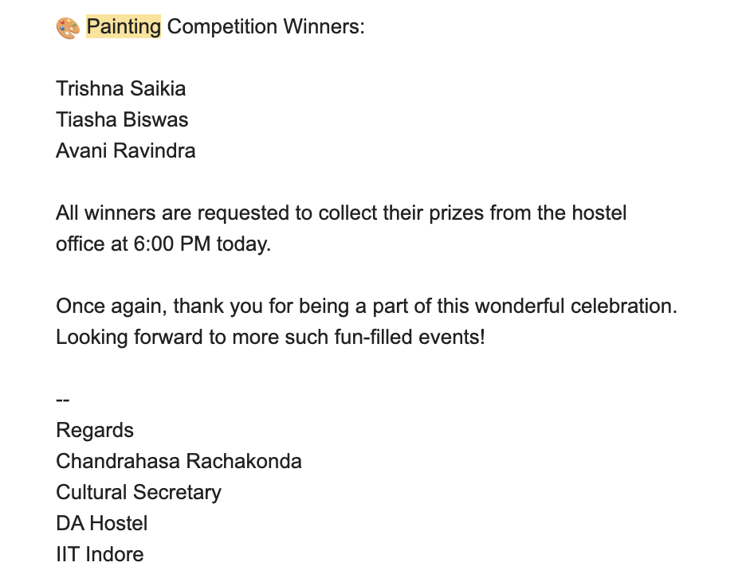
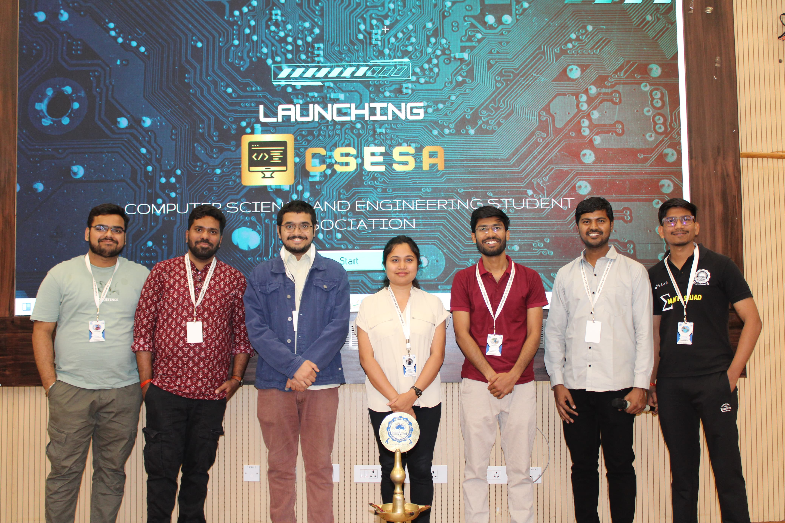
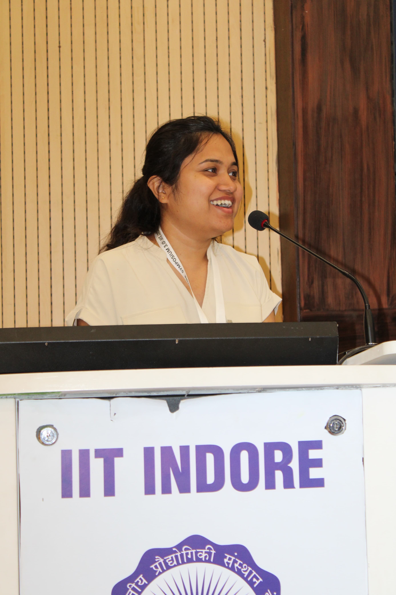
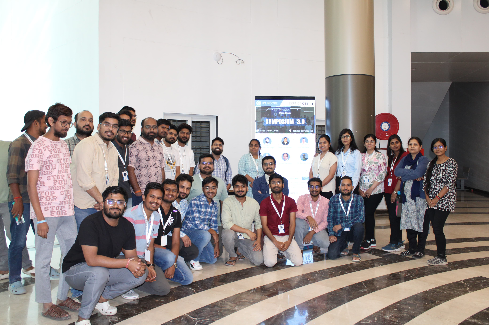
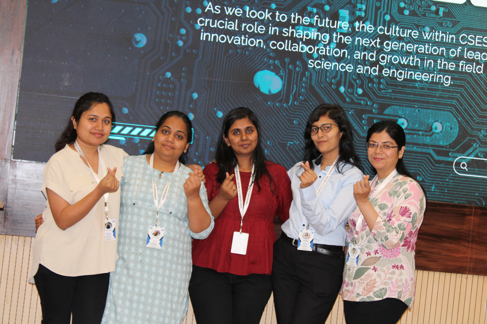

## Institute Best Technology Award, IIT Indore

Received the **Institute Best Technology Award** at IIT Indore for contributions to technology-driven research and innovation.

```{=html}
<div id="awardCarousel"
     class="carousel slide misc-carousel"
     data-bs-ride="carousel"
     data-bs-interval="2000">

  <!-- Dots -->
  <div class="carousel-indicators">
    <button type="button"
            data-bs-target="#awardCarousel"
            data-bs-slide-to="0"
            class="active"></button>

    <button type="button"
            data-bs-target="#awardCarousel"
            data-bs-slide-to="1"></button>

    <button type="button"
            data-bs-target="#awardCarousel"
            data-bs-slide-to="2"></button>
  </div>

  <div class="carousel-inner">
    <div class="carousel-item active">
      
    </div>

    <div class="carousel-item">
      
    </div>

    <div class="carousel-item">
      
    </div>
  </div>

  <button class="carousel-control-prev"
          type="button"
          data-bs-target="#awardCarousel"
          data-bs-slide="prev">
    <span class="carousel-control-prev-icon"></span>
  </button>

  <button class="carousel-control-next"
          type="button"
          data-bs-target="#awardCarousel"
          data-bs-slide="next">
    <span class="carousel-control-next-icon"></span>
  </button>

</div>
```
---

## India RISE Cohort

Participated in the **first India RISE Cohort**, an academic and leadership development initiative supporting early-career women researchers.

```{=html}
<div id="riseCarousel"
     class="carousel slide misc-carousel"
     data-bs-ride="carousel"
     data-bs-interval="2000">

  <div class="carousel-indicators">
      <button type="button" data-bs-target="#riseCarousel" data-bs-slide-to="0" class="active"></button>
      <button type="button" data-bs-target="#riseCarousel" data-bs-slide-to="1"></button>
      <button type="button" data-bs-target="#riseCarousel" data-bs-slide-to="2"></button>
      <button type="button" data-bs-target="#riseCarousel" data-bs-slide-to="3"></button>
      <button type="button" data-bs-target="#riseCarousel" data-bs-slide-to="4"></button>
  </div>

  <div class="carousel-inner">
    <div class="carousel-item active">
      
    </div>

    <div class="carousel-item">
      
    </div>

    <div class="carousel-item">
      
    </div>

    <div class="carousel-item">
      
    </div>

    <div class="carousel-item">
      
    </div>
  </div>

  <button class="carousel-control-prev"
          type="button"
          data-bs-target="#riseCarousel"
          data-bs-slide="prev">
    <span class="carousel-control-prev-icon"></span>
  </button>

  <button class="carousel-control-next"
          type="button"
          data-bs-target="#riseCarousel"
          data-bs-slide="next">
    <span class="carousel-control-next-icon"></span>
  </button>

</div>
```
---

## Inter-Hostel Drawing Competition, IIT Indore

Received the **first prize** in the inter-hostel drawing competition at IIT Indore.

```{=html}
<div id="drawingCarousel"
     class="carousel slide misc-carousel"
     data-bs-ride="carousel"
     data-bs-interval="2000">

  <div class="carousel-indicators">
      <button type="button" data-bs-target="#drawingCarousel" data-bs-slide-to="0" class="active"></button>
      <button type="button" data-bs-target="#drawingCarousel" data-bs-slide-to="1"></button>
  </div>

  <div class="carousel-inner">
    <div class="carousel-item active">
      
    </div>

    <div class="carousel-item">
      
    </div>
  </div>

  <button class="carousel-control-prev"
          type="button"
          data-bs-target="#drawingCarousel"
          data-bs-slide="prev">
    <span class="carousel-control-prev-icon"></span>
  </button>

  <button class="carousel-control-next"
          type="button"
          data-bs-target="#drawingCarousel"
          data-bs-slide="next">
    <span class="carousel-control-next-icon"></span>
  </button>

</div>
```
---

## Organizing Team, Symposium 3.0, IIT Indore

Served as part of the organizing team for **Symposium 3.0** at IIT Indore.

```{=html}
<div id="symposiumCarousel"
     class="carousel slide misc-carousel"
     data-bs-ride="carousel"
     data-bs-interval="2000">

  <div class="carousel-indicators">
      <button type="button" data-bs-target="#symposiumCarousel" data-bs-slide-to="0" class="active"></button>
      <button type="button" data-bs-target="#symposiumCarousel" data-bs-slide-to="1"></button>
      <button type="button" data-bs-target="#symposiumCarousel" data-bs-slide-to="2"></button>
      <button type="button" data-bs-target="#symposiumCarousel" data-bs-slide-to="3"></button>
  </div>

  <div class="carousel-inner">
    <div class="carousel-item active">
      
    </div>

    <div class="carousel-item">
      
    </div>

    <div class="carousel-item">
      
    </div>

    <div class="carousel-item">
      
    </div>
  </div>

  <button class="carousel-control-prev"
          type="button"
          data-bs-target="#symposiumCarousel"
          data-bs-slide="prev">
    <span class="carousel-control-prev-icon"></span>
  </button>

  <button class="carousel-control-next"
          type="button"
          data-bs-target="#symposiumCarousel"
          data-bs-slide="next">
    <span class="carousel-control-next-icon"></span>
  </button>

</div>
```