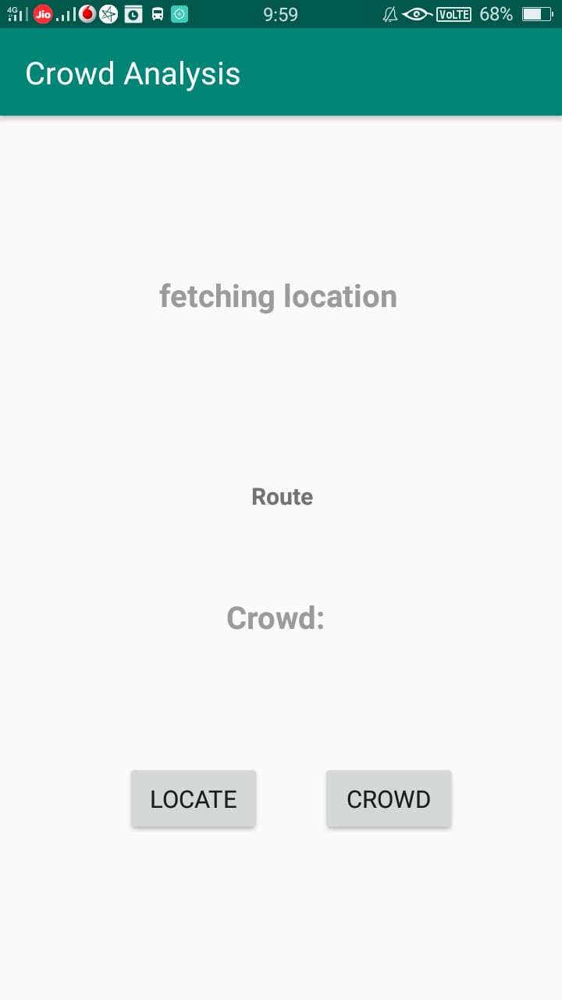
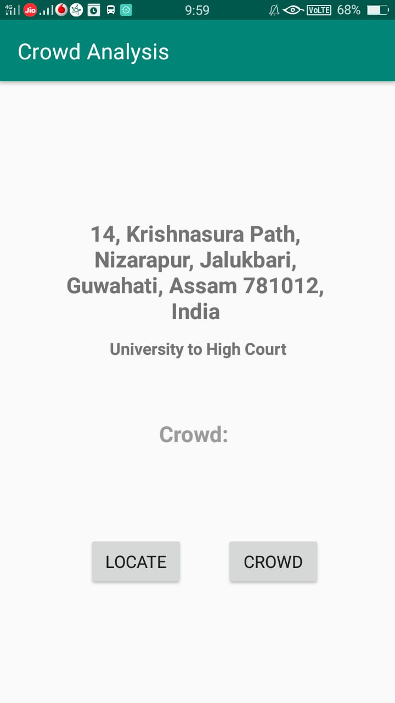
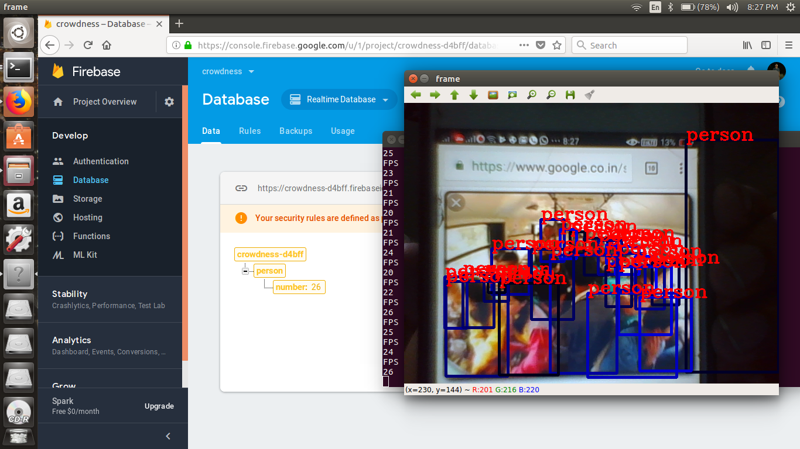
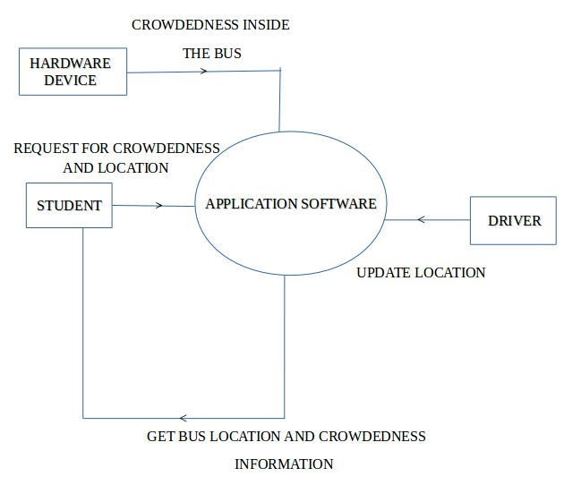

A real-time vehicle tracking and crowdedness estimation system was developed using computer vision and machine learning techniques.

The system enables users to monitor the location of public vehicles and estimate passenger density within the vehicle through image and video-based analysis, combined with GPS tracking information.

## Project Gallery

::: {.grid}

::: {.g-col-4}
{fig-alt="Request for Fetching Location"}
:::

::: {.g-col-4}
{fig-alt="Fetched the location"}
:::

::: {.g-col-4}
{fig-alt="Vehicle tracking application interface"}
:::

::: {.g-col-4}
{fig-alt="Crowd detection inside the bus"}
:::

::: {.g-col-4}
{fig-alt="System architecture diagram"}
:::

:::
## Key Features

- Real-time public vehicle tracking
- Crowdedness estimation inside the vehicle
- YOLO-based object/person detection
- Android application interface
- Firebase-based backend support

## Tools and Technologies

- Python
- OpenCV
- YOLO / Darkflow
- Android Studio
- Firebase
- Machine Learning